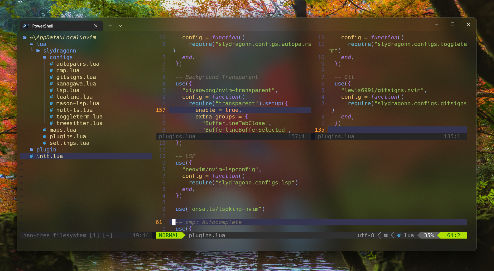

# Slydragonn's dotfiles

My personal dotfiles for Neovim (Packer/Lazy), PowerShell, and Qtile configurations.



## 📦 Included Configurations

| Tool           | Description                   | Config Path              |
| -------------- | ----------------------------- | ------------------------ |
| **Neovim**     | IDE-like setup with Lazy.nvim | `~/dotfiles/nvim/lazy/`  |
| **PowerShell** | Profile/aliases/scripts       | `~/dotfiles/powershell/` |
| **Qtile**      | Window manager config         | `~/dotfiles/qtile/`      |

## 📚 Articles

- [Ultimate Neovim Setup Guide: lazy.nvim Plugin Manager](https://dev.to/slydragonn/ultimate-neovim-setup-guide-lazynvim-plugin-manager-23b7)
- [How to Set up the Windows terminal with Powershell and Oh My Posh](https://dev.to/slydragonn/how-to-set-up-the-windows-terminal-with-powershell-and-oh-my-posh-2ba4)
- [How to Set up Neovim for Windows and Linux with Lua and Packer](https://dev.to/slydragonn/how-to-set-up-neovim-for-windows-and-linux-with-lua-and-packer-2391)

## 🚀 Installation

### Prerequisites

- Bash (Linux/macOS) or PowerShell (Windows)
- Neovim ≥ 0.10 (for Lazy.nvim config)
- [Git](https://git-scm.com/downloads)
- [Nerd Fonts](https://www.nerdfonts.com/font-downloads)
- NodeJS with npm
- [Lazy.vim](https://github.com/folke/lazy.nvim)
- A C compiler in your path and libstdc++ installed: [Windows support](https://github.com/nvim-treesitter/nvim-treesitter/wiki/Windows-support)

### Automated Setup

#### Linux/macOS

```bash
git clone https://github.com/slydragonn/dotfiles.git ~/dotfiles
cd ~/dotfiles
chmod +x install-dotfiles.sh
./install-dotfiles.sh
```

#### Windows (Admin PowerShell)

```powershell
git clone https://github.com/slydragonn/dotfiles.git $env:USERPROFILE\dotfiles
cd $env:USERPROFILE\dotfiles
Set-ExecutionPolicy Bypass -Scope Process -Force
.\install-dotfiles.ps1
```

### Manual Setup

Follow the individual README instructions:

- [lazy setup](./nvim/lazy/README.md)
- [packer setup](./nvim/packer/README.md)

Or via Symlinks:

```bash
# Neovim
ln -s ~/dotfiles/nvim/lazy ~/.config/nvim

# PowerShell (Linux/macOS)
ln -s ~/dotfiles/powershell/profile.ps1 ~/.config/powershell/Microsoft.PowerShell_profile.ps1

# Qtile
ln -s ~/dotfiles/qtile ~/.config/qtile
```

## 🔧 Features

### Neovim Setup

- **Lazy.nvim** plugin manager
- Pre-configured LSP
- Telescope fuzzy finder
- Custom keymaps (see `lua/slydragonn/maps.lua`)

## 🧩 Structure

```
dotfiles/
├── nvim/               # Neovim configs
│   ├── lazy/           # Lazy.nvim setup
│   └── packer/         # Legacy Packer.nvim setup
├── powershell/
└── qtile/
```

## ⚠️ Troubleshooting

**Neovim issues:**

1. Run `:checkhealth`
2. Ensure Node.js ≥ 16.x is installed
3. Delete `~/.local/share/nvim` if plugins misbehave

**PowerShell:**

- Enable scripts first:
  ```powershell
  Set-ExecutionPolicy RemoteSigned -Scope CurrentUser
  ```

## 🤝 Contributing

Pull requests welcome! For major changes, please open an issue first.
