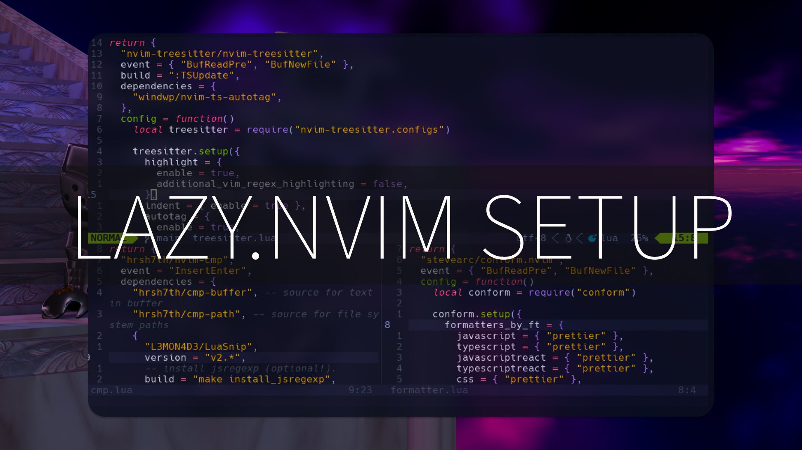

# Neovim Setup with Lazy.vim



## 🚀 Installation

1. Clone the repository:

```bash
git clone https://github.com/slydragonn/dotfiles.git
```

2. Move `dotfiles/nvim/lazy` directory to:

- **Windows**: `$env:LOCALAPPDATA\nvim\`

- **Linux**: `~/.config/nvim/`

## 📚 Articles

- [Ultimate Neovim Setup Guide: lazy.nvim Plugin Manager](https://dev.to/slydragonn/ultimate-neovim-setup-guide-lazynvim-plugin-manager-23b7)

## ⚙ Requirements

- Neovim >= v0.10.0
- [Nerd Fonts](https://www.nerdfonts.com/font-downloads)
- NodeJS with npm
- [Lazy.vim](https://github.com/folke/lazy.nvim)
- A C compiler in your path and libstdc++ installed: [Windows support](https://github.com/nvim-treesitter/nvim-treesitter/wiki/Windows-support)
- [Git](https://git-scm.com/downloads)

## 📚 Project Structure

```
📂 nvim/
├── 📂 lua/📂 slydragonn/
│	 └── 📂 plugins/
│        └── 📂 lsp/
│        └── ...pluginconfigfiles
│	 └── 🌑 settings.lua
│	 └── 🌑 maps.lua
│    └── 🌑 lazy.lua
└── 🌑 init.lua
```

### ✨ Features

- [folke/lazy.nvim](https://github.com/folke/lazy.nvim): A modern plugin manager for Neovim
- [nvim-neo-tree/neo-tree](https://github.com/nvim-neo-tree/neo-tree.nvim): Neovim plugin to manage the file system and other tree like structures.
- [EdenEast/nightfox.nvim](https://github.com/EdenEast/nightfox.nvim): A highly customizable theme for vim and neovim with support for lsp, treesitter and a variety of plugins.
- [nvim-tree/nvim-web-devicons](https://github.com/nvim-tree/nvim-web-devicons): lua fork of vim-web-devicons for neovim.
- [nvim-lualine/lualine.nvim](https://github.com/nvim-lualine/lualine.nvim): A blazing fast and easy to configure neovim statusline plugin written in pure lua.
- [nvim-treesitter/nvim-treesitter](https://github.com/nvim-treesitter/nvim-treesitter): Nvim Treesitter configurations and abstraction layer.
- [windwp/nvim-ts-autotag](https://github.com/windwp/nvim-ts-autotag): Use treesitter to auto close and auto rename html tag.
- [stevearc/conform.nvim](https://github.com/stevearc/conform.nvim): Lightweight yet powerful formatter plugin for Neovim.
- [nvim-telescope/telescope.nvim](https://github.com/nvim-telescope/telescope.nvim): Highly extendable fuzzy finder over lists.
- [neovim/nvim-lspconfig](https://github.com/neovim/nvim-lspconfig): Quickstart configs for Nvim LSP
- [hrsh7th/nvim-cmp](https://github.com/hrsh7th/nvim-cmp): A completion plugin for neovim coded in Lua.
- [williamboman/mason.nvim](https://github.com/williamboman/mason.nvim): Portable package manager for Neovim that runs everywhere Neovim runs.
- [norcalli/nvim-colorizer.lua](https://github.com/norcalli/nvim-colorizer.lua): Color highlighter.
- [akinsho/toggleterm.nvim](https://github.com/akinsho/toggleterm.nvim): A neovim lua plugin to help easily manage multiple terminal windows.
- [lewis6991/gitsigns.nvim](https://github.com/lewis6991/gitsigns.nvim): Git integration for buffers.
- [windwp/nvim-autopairs](https://github.com/windwp/nvim-autopairs): Autopairs for neovim written by lua.
- [onsails/lspkind.nvim](https://github.com/onsails/lspkind.nvim): vscode-like pictograms for neovim lsp completion items.
- [L3MON4D3/LuaSnip](https://github.com/L3MON4D3/LuaSnip): Snippet Engine for Neovim written in Lua.
- [hrsh7th/cmp-nvim-lsp:](https://github.com/hrsh7th/cmp-nvim-lsp) nvim-cmp source for neovim builtin LSP client
- [hrsh7th/cmp-path:](https://github.com/hrsh7th/cmp-path) nvim-cmp source for path
- [hrsh7th/cmp-buffer:](https://github.com/hrsh7th/cmp-buffer) nvim-cmp source for buffer words
- [williamboman/mason-lspconfig.nvim:](https://github.com/williamboman/mason-lspconfig.nvim) Extension to mason.nvim that makes it easier to use lspconfig with mason.nvim.
- [WhoIsSethDaniel/mason-tool-installer.nvim:](https://github.com/WhoIsSethDaniel/mason-tool-installer.nvim) Install and upgrade third party tools automatically.
